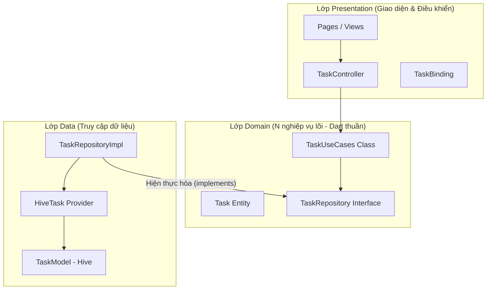
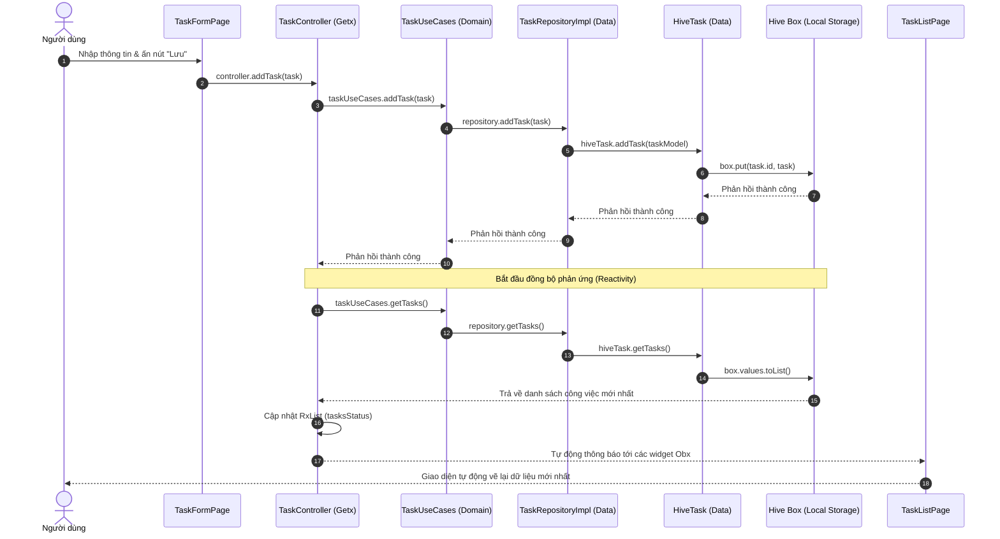

# Flutter CRUD App - Clean Architecture with GetX & Hive

Dự án này là một ứng dụng quản lý công việc (Task CRUD) được xây dựng trên nền tảng Flutter. Dự án áp dụng mô hình **Clean Architecture** (phân lớp chặt chẽ) kết hợp với **GetX** (State Management & Routing) và **Hive** (Cơ sở dữ liệu cục bộ NoSQL).

## Demo
<p align="center">
  <video src="https://github.com/user-attachments/assets/09372848-f3f3-4df7-8387-847040b220c8" width="400" controls></video>
</p>
---

## 1. Kiến Trúc Dự Án (Architecture Layout)

Kiến trúc dự án tuân thủ nguyên lý Clean Architecture của Robert C. Martin, chia ứng dụng thành 3 lớp cốt lõi: **Domain**, **Data**, và **Presentation**. Mỗi lớp có một nhiệm vụ riêng biệt và phụ thuộc một chiều từ ngoài vào trong.



### Chi tiết các lớp:
* **Domain Layer (Lớp nghiệp vụ)**: 
  * Là trái tim của ứng dụng, chứa mã nguồn **Dart thuần túy** (không import Flutter, GetX hay Hive).
  * `Entities`: Các thực thể kinh doanh cơ bản (lớp `Task`).
  * `Repository Interfaces`: Các giao diện định nghĩa cách lấy dữ liệu (lớp trừu tượng `TaskRepository`).
  * `UseCases`: Chứa logic nghiệp vụ ứng dụng cụ thể (lớp `TaskUseCases` gộp các hành động CRUD).
* **Data Layer (Lớp dữ liệu)**:
  * Chịu trách nhiệm lưu trữ và truy xuất dữ liệu từ database cục bộ hoặc API từ internet.
  * `Models`: Chuyển đổi dữ liệu và gắn annotation phục vụ cơ sở dữ liệu (lớp `TaskModel` với `@HiveType`).
  * `Providers`: Tương tác trực tiếp với SDK bên ngoài (lớp `HiveTask` thao tác trực tiếp với Hive Box).
  * `Repositories Implementation`: Triển khai các phương thức định nghĩa trong lớp Domain (lớp `TaskRepositoryImpl`).
* **Presentation Layer (Lớp hiển thị)**:
  * Chịu trách nhiệm hiển thị giao diện người dùng và điều phối luồng trạng thái.
  * `Pages`: Các màn hình UI (`TaskListPage`, `TaskFormPage`) được bao bọc bởi `Obx` để lắng nghe reactive state.
  * `Controllers`: Bộ điều khiển GetxController (`TaskController`) chứa các trạng thái reactive (`RxList`, `RxBool`, `RxString`).
  * `Bindings`: Đăng ký Dependency Injection (`TaskBinding`) để khởi tạo và truyền các dependencies tương thích.
* **Core Layer**: Chứa các cấu hình chung, định tuyến (`app_pages.dart`, `app_routes.dart`), theme và các hằng số.

---

## 2. Sơ Đồ Luồng Dữ Liệu & Trạng Thái (State & Data Flow)

Sơ đồ tuần tự dưới đây minh họa luồng xử lý và đồng bộ trạng thái khi người dùng thực hiện tạo mới một công việc (Create Task):



---

## 3. Đánh Giá Đánh Đổi (Architectural Trade-offs)

Mỗi mô hình kiến trúc đều có điểm mạnh và điểm yếu. Dưới đây là bảng phân tích trade-offs của dự án này:

| Yếu tố | Điểm mạnh (Pros) | Điểm yếu (Cons) |
| :--- | :--- | :--- |
| **Tính Độc Lập (Decoupling)** | Lớp Domain không phụ thuộc vào Flutter, GetX hay Hive. Sau này nếu đổi database (SQLite, Firebase) hoặc đổi State Management (BLoC, Riverpod), logic nghiệp vụ không bị ảnh hưởng. | Đòi hỏi viết nhiều file trung gian (Boilerplate). Một luồng CRUD đơn giản phải đi qua 5-6 lớp dẫn tới tăng số lượng file mã nguồn. |
| **Kiểm Thử (Testing)** | Viết Unit Test cho lớp Domain cực kỳ dễ dàng, nhanh chóng mà không cần chạy máy ảo hay mock các thư viện phức tạp. | Tốn nhiều thời gian cấu hình và viết mock-ups trong giai đoạn đầu tiên của dự án. |
| **Bảo Trì & Mở Rộng** | Phân chia trách nhiệm rõ ràng (Single Responsibility). Tránh xung đột code (conflict) khi làm việc nhóm lớn. Dễ định vị lỗi (Bug). | Khó tiếp cận đối với người mới bắt đầu hoặc các dự án siêu nhỏ vì cấu trúc phân mảnh phức tạp. |
| **Lưu Trữ (Hive)** | Hive hoạt động cực kỳ nhanh vì chạy trực tiếp trên bộ nhớ đệm, tối ưu hiệu năng cho thiết bị di động. | Phụ thuộc vào việc tự động sinh Adapter (`build_runner`). Mỗi lần thay đổi cấu trúc Model phải chạy lại lệnh generator. |

---

## 4. Hướng Dẫn Chạy Dự Án (Getting Started)

### Yêu cầu hệ thống:
* Flutter SDK (hỗ trợ Dart 3)

### Các bước khởi động:

1. **Cài đặt các thư viện phụ thuộc:**
   ```bash
   flutter pub get
   ```

2. **Sinh mã Adapter tự động cho Hive (chỉ chạy khi thay đổi Model):**
   ```bash
   flutter pub run build_runner build --delete-conflicting-outputs
   ```

3. **Chạy kiểm thử tự động (Widget & Logic Tests):**
   ```bash
   flutter test
   ```

4. **Khởi chạy ứng dụng:**
   ```bash
   flutter run
   ```
